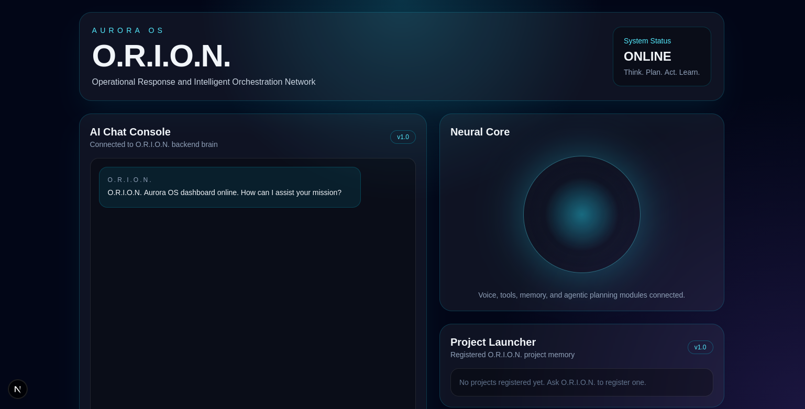
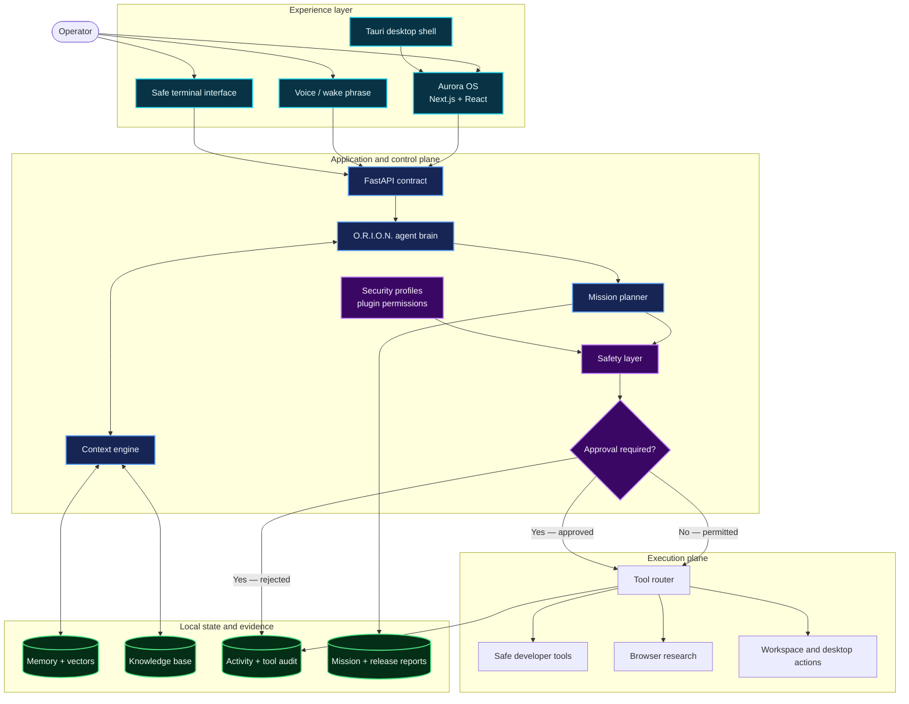
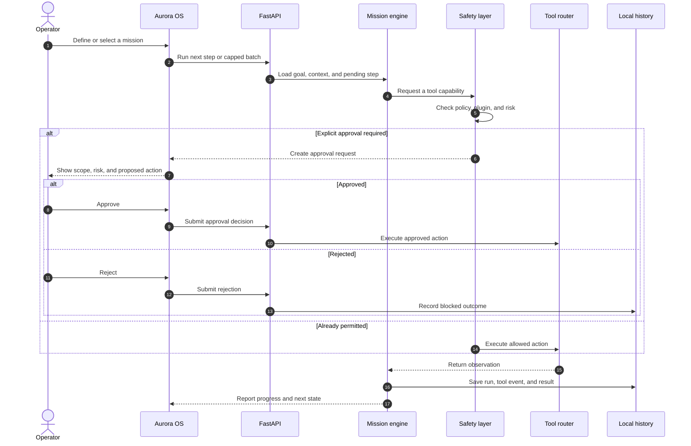
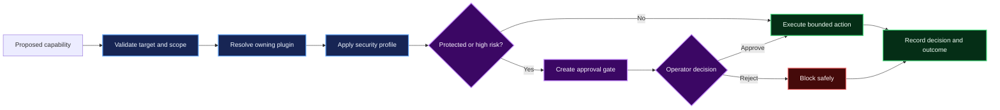
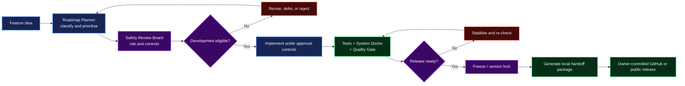

<div align="center">

# O.R.I.O.N.

### Operational Response and Intelligent Orchestration Network

**Think. Plan. Act. Learn.**

Local-first AI mission control with approval-gated autonomy.

[](release-manifest.json)
[](docs/versioning.md)
[](docs/safety-model.md)

</div>

---

**O.R.I.O.N.** is a local-first AI desktop agent and operational mission-control system. It brings assistant chat, structured missions, persistent memory, workspace intelligence, controlled tools, security policy, audit history, and release governance into one user-controlled environment.

Its visual command center, **Aurora OS**, is a responsive Next.js interface backed by FastAPI and packaged as a Tauri desktop application. The system is designed for useful autonomy without invisible authority: sensitive actions pass through policy checks, plugin permissions, explicit approval gates, and an auditable activity trail.

> The active product version is **O.R.I.O.N. v6.7.0**. Backend, API, frontend, Aurora UI, Tauri configuration, and Rust package metadata are synchronized from [`release-manifest.json`](release-manifest.json). References to v6.5.x describe historical release workflows, not the current runtime version.



<p align="center"><sub>Historical Aurora OS dashboard preview. See the <a href="docs/screenshot-showcase.md">screenshot showcase</a> for capture guidance.</sub></p>

<p align="center">
  <a href="#why-orion-exists">Background</a> ·
  <a href="#system-architecture">Architecture</a> ·
  <a href="#core-capabilities">Capabilities</a> ·
  <a href="#safety-and-governance">Safety</a> ·
  <a href="#quick-start">Quick start</a> ·
  <a href="#documentation">Documentation</a>
</p>

## Project at a glance

| Area | Current position |
| --- | --- |
| Product | Local-first AI agent and mission-control desktop system |
| Command center | Aurora OS — chat, missions, memory, workspaces, tools, security, analytics, and governance |
| Current version | v6.7.0 — generated from `release-manifest.json` |
| Release channel | Development; local quality gates pass, CI evidence remains required for an official candidate |
| Execution model | User-controlled, policy-aware, approval-gated, and audited |
| Runtime | FastAPI backend + Next.js frontend + optional Tauri desktop shell |
| Data posture | Local application state; generated databases, reports, credentials, and builds stay out of version control |
| Project type | Personal portfolio and research project |

## Why O.R.I.O.N. exists

Most assistant prototypes stop at a chat box or give an agent broad access to a machine. O.R.I.O.N. explores the space between those extremes: an assistant that can plan and act, while keeping the operator in control of consequential execution.

The current codebase combines four concerns that are often built separately:

1. **Intelligence** — conversational assistance, contextual retrieval, memory, semantic search, and research.
2. **Orchestration** — goals, mission steps, workflow blueprints, capped execution cycles, and run history.
3. **Control** — permissions, policy profiles, approval gates, protected tools, and audit records.
4. **Governance** — diagnostics, quality gates, release freezes, readiness checks, roadmap review, and public handoff artifacts.

## Project evolution

O.R.I.O.N. grew incrementally from a safe local assistant into a governed desktop platform. Each phase retained the safety constraints of the previous one while adding a new operational layer.

```mermaid
flowchart LR
    A["Foundation<br/>v0.1–v1.3<br/>agent, chat, voice, dashboard, memory"]
    B["Controlled missions<br/>v1.4–v2.6<br/>planning, approvals, runs, workspaces, desktop"]
    C["Context and intelligence<br/>v2.7–v3.3<br/>knowledge, vectors, workflows, analytics, settings"]
    D["Security and platform<br/>v3.4–v4.9<br/>plugins, audit, policies, Tauri, quality gate"]
    E["Public readiness<br/>v5.0–v6.3<br/>portfolio, launch, stable release, maintenance"]
    F["Governed development<br/>v6.4–v6.5<br/>roadmap, safety review, feature approval"]
    G["Maintenance line<br/>v6.5.1–v6.5.2<br/>runtime stability and UI truthfulness"]

    A --> B --> C --> D --> E --> F --> G

    classDef foundation fill:#0f172a,stroke:#22d3ee,color:#e2e8f0,stroke-width:2px;
    classDef intelligence fill:#172554,stroke:#60a5fa,color:#eff6ff,stroke-width:2px;
    classDef governance fill:#2e1065,stroke:#a78bfa,color:#f5f3ff,stroke-width:2px;
    class A,B foundation;
    class C,D intelligence;
    class E,F,G governance;
```



The detailed release history is recorded in the [changelog](CHANGELOG.md). The [public handoff summary](docs/PUBLIC_HANDOFF_SUMMARY_v6.5.md) defines the v6.5 presentation baseline.

## System architecture

Aurora OS is the operator-facing layer. FastAPI exposes the application contract, the agent and context layers assemble work, and the safety plane decides whether a protected capability can proceed. Execution and state changes are recorded locally for later inspection.



## Mission execution model

Missions are structured, observable units of work rather than unbounded background automation. The backend supports one-step execution and a capped multi-step cycle, preserving approval pauses and run history at every stage.



## Safety and governance

O.R.I.O.N. treats safety as a system property, not a warning label. Decisions are backend-authoritative and are designed to fail closed when a protected mapping, permission, or audit write cannot be validated.



The principal boundaries are:

- No unrestricted shell executor or destructive file-deletion tool.
- Safe file and workspace operations remain scoped to registered project roots.
- Protected desktop and tool actions require the applicable permission and approval.
- Strict, Balanced, and Developer Lab profiles change risk posture without removing approval enforcement.
- Tool decisions, failures, and blocked attempts are retained in the local audit stream.
- Feature approval determines development eligibility; it does not implement or publish a feature.
- Release workflows generate local evidence and packages only. They do not push commits, publish releases, expose credentials, or bypass a freeze.
- Credentials, local databases, runtime state, generated reports, newly generated screenshots, and build output are excluded from commits; the curated showcase images are the intentional exception.

See the [safety model](docs/safety-model.md), [tool permission enforcement](docs/tool-permission-enforcement.md), [security policy profiles](docs/security-policy-profiles.md), and [Safety Review Board](docs/safety-review-board-v6-5.md) for implementation details.

## Evidence-based capability matrix

Status means **COMPLETE** when the repository contains an exercised end-to-end implementation, **PARTIAL** when a usable implementation still has a material boundary, and **PLANNED** when the capability is intentionally not implemented. Historical release notes are not treated as evidence.

| Capability | Status | Current evidence and boundary |
| --- | --- | --- |
| Capability Gateway and tool policy | **COMPLETE** | All mapped side effects pass through `backend/core/capability_gateway.py`; direct-call, route, mission, plugin, and tool bypass regressions fail closed. |
| Transactional approvals and mission continuation | **COMPLETE** | Atomic claims, idempotency, payload hashes, terminal guards, and durable mission/step continuations are covered in `backend/tests/test_approval_transactions.py`. |
| Durable mission lifecycle | **COMPLETE** | Validated transitions, leases, pause/resume/cancel/retry, checkpoints, restart recovery, and bounded retries live in `backend/core/mission_manager.py`. |
| Scoped agent sessions and model execution | **PARTIAL** | Conversation isolation, configured model selection, fallback, and usage accounting work; the provider registry currently ships only an OpenAI adapter. |
| Memory, knowledge, and context controls | **COMPLETE** | Workspace/project scope, provenance, sensitivity, expiry, exclusion, edit/delete, and retrieval explanations have regression coverage. |
| Browser research security | **COMPLETE** | DNS/IP validation, redirect revalidation, response limits, proxy isolation, and SSRF cases are exercised in `backend/tests/test_browser_research_security.py`. |
| Trusted workspace and filesystem access | **COMPLETE** | Registered roots, consent, `Path.relative_to` containment, symlink defenses, and sensitive-file denials are backend enforced. |
| Correlated security and mission audit | **COMPLETE** | Actor, policy, mission, step, approval, argument hash, result, duration, and correlation data can reconstruct a mission timeline. |
| Persistent storage migrations and recovery | **COMPLETE** | Fifteen SQLite stores use version tracking, WAL and foreign keys; verified, hash-bound backup/restore is exposed under System. |
| Local control API authentication | **COMPLETE** | Tauri creates an ephemeral launch token; every non-health route authenticates it and records the local session identity. |
| Aurora information architecture | **COMPLETE** | Seven primary destinations plus contextual task navigation are route-tested and rendered through the shared application shell. |
| Command palette | **COMPLETE** | Registry search, arrow-key selection, Enter navigation, route validation, and explicit mutation confirmation are component-tested. |
| Operational analytics | **COMPLETE** | Production UI metrics come from persisted event queries; unavailable sources render as unavailable rather than synthetic values. |
| Plugin management | **PARTIAL** | Registry, enable/disable controls, ownership, permission enforcement, and audit exist; there is no third-party SDK or process sandbox. |
| Explicit voice capture | **PARTIAL** | Push-to-talk permission, bounded transcription, transcript confirmation, and unsent Assistant handoff are integrated. Packaged microphone behavior still requires release-device validation; wake phrase listening is disabled in Aurora OS. |
| Desktop packaging and supervision | **PARTIAL** | macOS is the supported primary target with release-time signing/notarization enforcement. Windows and Linux are explicitly unadvertised previews until their promotion evidence is complete. |
| Release governance | **PARTIAL** | Local quality gates, artifact hashes, scans, and required CI workflows exist; an actual passing CI run and signed release artifacts are still required. |
| Third-party plugin sandbox and SDK | **PLANNED** | Intentionally deferred until a stable capability ABI and isolation model are designed. |
| Automatic updates and multi-platform distribution | **PLANNED** | No updater channel or production signing/notarization pipeline is implemented. |

## Governed feature and release lifecycle

Future work moves through evidence-producing gates before it can join a release. Every transition remains local until the owner deliberately performs an external Git or publishing action.



## Technology stack

| Layer | Technology |
| --- | --- |
| Web interface | Next.js 16, React 19, TypeScript, Tailwind CSS 4 |
| Client state and data | Zustand, TanStack Query, shared typed API clients |
| Interaction and graphs | cmdk, Lucide React, React Flow |
| Backend | Python, FastAPI, Pydantic, Uvicorn |
| Agent and model integration | OpenAI SDK, OpenAI Agents SDK |
| Local intelligence | NumPy-backed vector operations, local memory and knowledge modules |
| Persistence | Local JSON and SQLite-backed application state |
| Voice | pyttsx3 and sounddevice |
| Desktop | Tauri 2 |
| Verification | Python `unittest`, compile checks, TypeScript checks, ESLint, Next.js production builds, API verification scripts |

## Quick start

### Prerequisites

- Python 3 with `venv`
- Node.js and npm
- An OpenAI API key for model-backed features
- Rust and the platform prerequisites for Tauri desktop development or packaging

### Install

```bash
cd ~
git clone https://github.com/VidulaWickramasinghe/O.R.I.O.N.git O.R.I.O.N
cd ~/O.R.I.O.N/

./scripts/setup_orion.sh
```

The setup script creates `.venv`, installs Python and frontend dependencies, copies `backend/.env.example` to `backend/.env` when needed, and runs backend compile diagnostics. Add your API key locally:

```dotenv
OPENAI_API_KEY=your-openai-api-key
```

Never commit `backend/.env` or a real credential.

### Diagnose and run

```bash
cd ~/O.R.I.O.N/
./scripts/doctor.sh
./scripts/start_orion.sh
```

| Service | Local URL |
| --- | --- |
| Aurora OS | [http://localhost:3000](http://localhost:3000) |
| Backend API | [http://127.0.0.1:8000](http://127.0.0.1:8000) |
| OpenAPI schema | [http://127.0.0.1:8000/openapi.json](http://127.0.0.1:8000/openapi.json) |

Press `Ctrl+C` in the launcher terminal to stop both services.

## Desktop application

Start the local backend when needed and open Aurora OS in its Tauri shell:

```bash
cd ~/O.R.I.O.N/
./scripts/orion_desktop.sh
```

For desktop development and packaging:

```bash
./scripts/run_desktop_dev.sh
./scripts/build_desktop_app.sh
```

Bundles are generated under `frontend/src-tauri/target/release/bundle/` and are intentionally excluded from version control. See the [desktop platform support matrix](docs/platform-support.md) before making distribution claims; Windows and Linux are preview targets, not supported releases.

## Verification and quality gate

Run the full local quality workflow:

```bash
cd ~/O.R.I.O.N/
./scripts/test_backend.sh
./scripts/test_frontend.sh
./scripts/quality_gate.sh
```

The quality gate compiles and runs the backend regression suite, produces a frontend production build, and verifies the live API when the backend is reachable. Its generated report is written below `backend/data/quality_gate_reports/` and remains untracked.

With the backend running, the same build-aware gate is available through the API:

```bash
curl -X POST http://127.0.0.1:8000/api/quality-gate/run \
  -H "Content-Type: application/json" \
  -d '{"run_builds":true}'
```

## Selected API surface

| Domain | Representative routes |
| --- | --- |
| Health and dashboard | `GET /api/health`, `GET /api/status`, `GET /api/dashboard/intelligence` |
| Missions and approvals | `GET /api/missions`, `POST /api/missions/{id}/run-next`, `POST /api/missions/{id}/run-batch`, `GET /api/approvals` |
| Context and knowledge | `POST /api/context/preview`, `POST /api/knowledge/search`, `POST /api/vector/search` |
| Workspaces and research | `GET /api/workspaces`, `POST /api/workspaces/register`, `POST /api/browser/research` |
| Plugins and security | `GET /api/plugins`, `GET /api/tools/permissions`, `GET /api/tools/audit`, `GET /api/security/policy` |
| Governance | `/api/release-candidate/*`, `/api/quality-gate/*`, `/api/roadmap-planner/*`, `/api/safety-review-board/*` |

The [API contract map](docs/api-contract-map.md) documents the verified route families. When the backend is running, its OpenAPI document is the authoritative machine-readable contract.

## Repository map

```text
O.R.I.O.N/
├── backend/
│   ├── api_main.py          # FastAPI application and public API contract
│   ├── core/                # missions, memory, policy, governance, and domain logic
│   ├── tools/               # bounded tools and permission-aware adapters
│   ├── tests/               # backend regression coverage
│   └── data/                # local runtime state and generated artifacts
├── frontend/
│   ├── src/app/             # Aurora OS routes and global styles
│   ├── src/components/      # shell, workspaces, panels, and shared UI
│   ├── src/lib/api/         # centralized backend service layer
│   ├── src/store/           # application state
│   └── src-tauri/           # desktop wrapper and bundle configuration
├── scripts/                 # setup, launch, diagnosis, test, and build workflows
├── docs/                    # architecture, safety, release, and handoff records
└── assets/screenshots/      # curated presentation images
```

Generated databases, reports, credentials, static exports, dependencies, desktop bundles, and other runtime artifacts must not be committed.

## Documentation

- [Installation guide](docs/installation.md)
- [System architecture](docs/architecture.md)
- [Aurora OS UI architecture](docs/aurora-os-ui-architecture.md)
- [Frontend/backend integration](docs/frontend-backend-integration.md)
- [API contract map](docs/api-contract-map.md)
- [Safety model](docs/safety-model.md)
- [Roadmap and safety governance](docs/roadmap-and-safety-governance.md)
- [Production readiness and stable release](docs/production-readiness-and-stable-release.md)
- [Public handoff summary v6.5](docs/PUBLIC_HANDOFF_SUMMARY_v6.5.md)
- [Full changelog](CHANGELOG.md)

## Public handoff

O.R.I.O.N. v6.5 represents the governed public portfolio baseline: a backend-connected Aurora OS experience, approval-gated execution, protected tooling, security policies, release verification, and a Safety Review Board for future development. Later patch work improves stability and UI truthfulness without silently changing that baseline.

For the release position, evidence, and presentation boundary, read [`docs/PUBLIC_HANDOFF_SUMMARY_v6.5.md`](docs/PUBLIC_HANDOFF_SUMMARY_v6.5.md).

## License

Copyright © 2026. All rights reserved.

O.R.I.O.N. is maintained as a personal portfolio and research project. Use, copying, modification, or redistribution requires permission from the project owner. See [LICENSE](LICENSE).

---

<div align="center">

**O.R.I.O.N.** — operational intelligence with the operator still in command.

</div>
